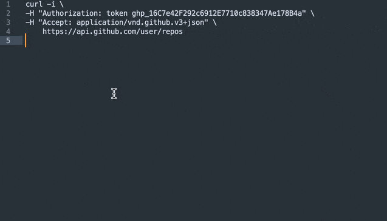

# SublimeCurlConvert

Convert curl commands to Python, Java for Sublime Text 3/4

## Features

* Convert curl commands
* Convert raw http request

## Installation
Clone this repository into Sublime Text "Packages" directory.

## Keybindings
* <kbd>control+c+p</kbd> or <kbd>ctrl+c+p</kbd> Convert to Python
* <kbd>control+c+j</kbd> or <kbd>ctrl+c+j</kbd> Convert to Java

## License
MIT © jeayu