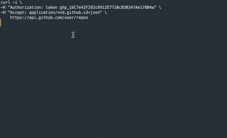

# SublimeCurlConvert

Convert curl commands to Python for Sublime Text 3/4

## Installation
Clone this repository into Sublime Text "Packages" directory.

## Keybindings
* <kbd>control+c+p</kbd> or <kbd>ctrl+c+p</kbd> Convert to python

## License
MIT © jeayu
